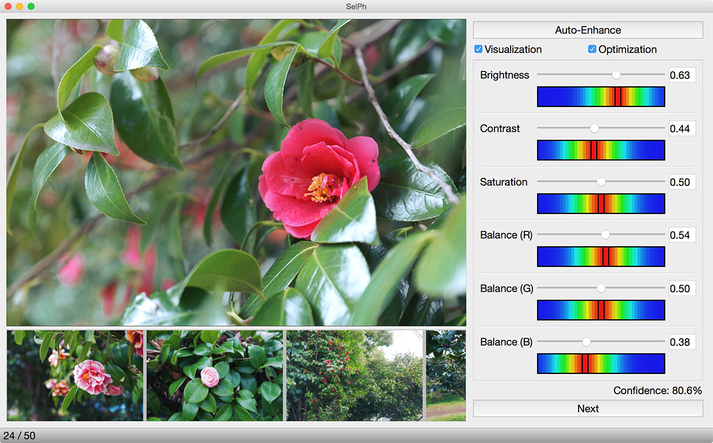

# SelPh

[](https://travis-ci.com/yuki-koyama/selph)


A machine-learning-based photo color enhancement system that implicitly learns users' preference.



### Publication
Yuki Koyama, Daisuke Sakamoto, and Takeo Igarashi. 2016. SelPh: Progressive Learning and Support of Manual Photo Color Enhancement. In Proceedings of the SIGCHI Conference on Human Factors in Computing Systems (CHI '16), pp.2520--2532. DOI: http://dx.doi.org/10.1145/2858036.2858111

### Project Page
Please visit our project page for details: <http://koyama.xyz/project/SelPh/>

### Languages and Runtime Environments
Main functionality is written in C++11. Real-time photo color enhancement is written in programmable shaders, which require support of both OpenGL 3.2 Core Profile and GLSL 3.3.

## Set Up

### macOS
This software has been written for and tested on macOS (x86_64). Other platforms (e.g., Windows, Linux) are currently not supported. If you want to build this software on other platforms, you might need to modify several parts (e.g., header paths). Pull requests welcome.

### Build using CMake
We use cmake https://cmake.org/ for building source codes.

```
git clone https://github.com/yuki-koyama/selph.git --recursive
cd selph
mkdir build
cd build
cmake ../
make
```

## License
The source codes are released under the **MIT License**; see LICENSE.txt.

## Dependencies

- Eigen http://eigen.tuxfamily.org/ (`brew install eigen`)
- Qt http://doc.qt.io/qt-5/ (`brew install qt`)
- enhancer https://github.com/yuki-koyama/enhancer (included as a submodule)
- mathtoolbox https://github.com/yuki-koyama/mathtoolbox (included as a submodule)
- nlopt https://nlopt.readthedocs.io/ (included as a submodule)
- parallel-util https://github.com/yuki-koyama/parallel-util (included as a submodule)
- tinycolormap https://github.com/yuki-koyama/tinycolormap (included as a submodule)

## Test Photographs
This repository includes a photo album for testing the software. These photographs were taken by Yuki Koyama, and licensed under [CC BY](https://creativecommons.org/licenses/by/4.0/). If you want higher resolution photographs, please contact us.

## Developer/Contact
[Yuki Koyama](https://koyama.xyz/) - [yuki@koyama.xyz](mailto:yuki@koyama.xyz)
